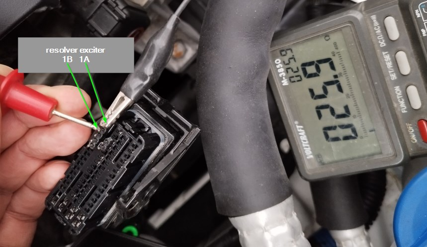
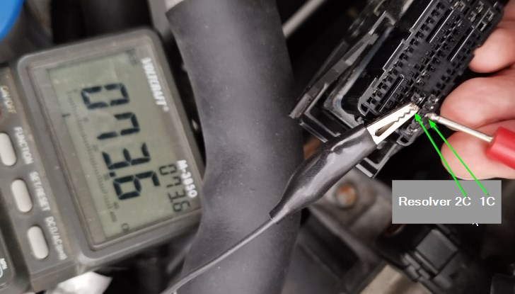
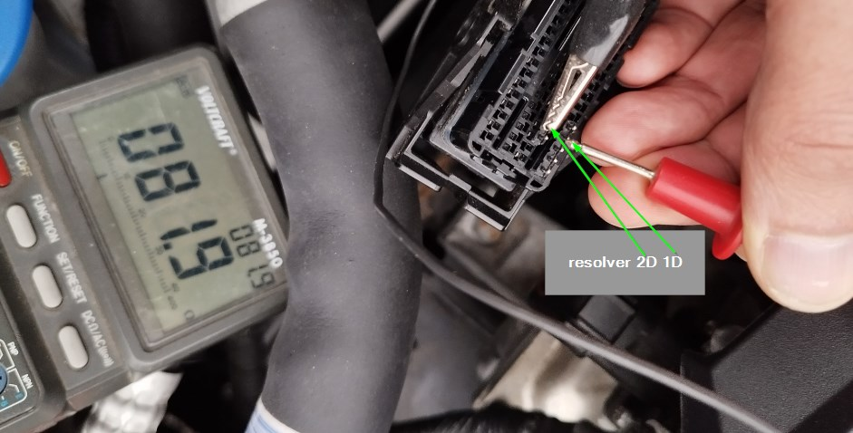
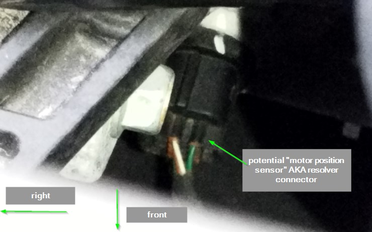

# EPCU

Contains the motor inverter and the 12V DCDC (aka LVDC aka LDC).

The main controller board and parts of the inverter gate driver board:


## Controller board

- Black connector CN1002 to DCDC boards
- big white connector CN1005 to the inverter gate driver board
- small white connector CN1004 to the phase current sensors

### CN1000 Harness Connector

- 4x16 pin connector CN1000 to the cable harness. The numbering is printed inside the connector. Letters A to Q (with I missing) and rows 1 to 4.

- 1A sine wave 10kHz, between 2V and 12V. The resolver exitation. On motor side ~25.7ohms. 
- 1B sine wave inverse to A1.
- 1C together with 2C: Resolver On motor side ~73ohms. 
- 1D together with 2D: Resolver. On motor side ~81ohms. 
- 1J+1K PCAN?, connected to two transceivers U9002 and U9003.
- 1L+1M diag CAN?, connected to two transceivers U9001 and U9000.
- 1O Data line U9500 "ST L9637" ISO9141 "K-Line" transceiver. https://www.st.com/en/automotive-analog-and-power/l9637.html
- 1Q GND

- 2C Resolver, see above
- 2D Resolver, see above
- 2M+2N spare CAN, not populated L9003, U9005.
- 2P, 2Q GND

- 3C accelerator pedal redundant 0.5V to 2V
- 3D 5V accelerator pedal supply 5V
- 3E 5V accelerator pedal supply 5V
- 3F accelerator pedal main 1V to 4V
- 3H shift paddle 1
- 3J shift paddle 2

- 3P wakeup line. 12V to enable the power supply of the board.
- 3Q 12V

- 4D GND accelerator pedal
- 4E GND accelerator pedal
- 4F, G4 bus choke L2601
- 4P, Q4 12V

#### Accelerometer pedal

Using 4.7kohm potis works. Pin F3 is the "main" input. Its value is reflected into CAN.VCU200.byte4 after power-up.
Pin C3 acts as "redundancy for plausibilization". If both pins come to different conclusions, the CAN value changes to 255 ("invalid") after
~2s. Sometimes, before reaching "invalid", the CAN value shows shortly the value of the redundancy pot. This helps debugging.
If the value reached the error value 255, a power-off-on heals the situation.

```
CAN   U1[V]  U2[V]
  0   0.96   0.58  
 10   1.07   0.60
 50   1.58   0.75
100   2.17   1.11
200   3.30   1.50
254   3.97   2.00
```

#### Shift Paddles

Pins 3H and 3J are at ~4.75V if nothing is connected. When adding a pull-down of 1k, they fall to 0.82V. They connect to switches on the steering wheel paddles.

3H is connected to the right paddle, "decrease recuperation". The switch is connected to vehicle ground. Unpressed infinite resistance. Pressed 202 ohm.

3J is connected to the left paddle, "increase recuperation". The switch is connected to vehicle ground. Unpressed infinite resistance. Pressed 202 ohm.


#### Motor Angle Position Sensor

Uses a resolver with one exitation coil and two feedback coils.

When measuring on the harness, surprisingly the two feedback coils have different resistance:
* 1C 2C 73.5 ohms
* 1D 2D 81.5 ohms
According to resolver_wiring_and_replace.pdf, this is normal.

The wiring diagram and manual how to change it is linked here: https://www.ioniqforum.com/threads/mcu-p0a41-drive-motor-a-position-sensor-circuit-low-and-high.49360/
PDF: resolver_wiring_and_replace.pdf

### Power Supply

The 12V power comes via the harness connector Q3, P4, Q4.
Reverse-polarity diodes D1100 and D1101.
U1100 TLE7368E provides different voltages: 5V, 3.3V and 1.5V. https://www.infineon.com/dgdl/Infineon-TLE7368-DataSheet-v02_60-EN.pdf?fileId=5546d46258fc0bc1015969d271b041d1
The TLE7368E needs a high signal on pin 10 "Enable Input Ignition Line". This is TP1105 (on back side), which is feed from CN1000.P3 via
D1105 and R1101 and R1102.

By connecting CN1000.P3 and Q3 to 12V, the EPCU starts to draw power (400mA at 12V) and the CANs are sending data.

### CAN busses

The EPCU contains two external available CAN busses, and two internal control units (Motor Controller "MCU" and Vehicle Controller "VCU"). Both
control units are connected to both CAN busses, so the EPCU has four CAN transceivers.

"Left CAN, CCP-CAN" TP9004:
```
0x2C1 in 1ms cycle with 00 00 FF 7F 00 00 00 00 
0x232 in 1ms cycle with 00 00 00 00 00 00 00 00 
0x58F in 100ms cycle with 08 40 00 00 00 00 40 1F 
```

"Right CAN, PCAN" TP 9008: A lot of messages, 0x109, 0x200, 0x201, 0x202, 0x291, 0x2A1, 0x523, 0x524, 0x540, 0x549, 0x579, 0x57A, 0x57B, 0x590, 0x592, 0x5DC, 0x5DE


Measure on the TX pin of each transceiver, which control unit sends which data on which CAN. How to find out, which CAN transceiver
is connected to which controller? Stop a controller by shorting the xtal.

* U9000 TX (pin1): 0x2C1
* U9001 TX (pin1): 0x232, 0x58F
* U9002 TX (pin1): 0x291, 0x2A1, 0x523, 0x524, 0x540, 0x5DC, 0x5DE. Stopping the MCU stops these messages.
* U9003 TX (pin1): 0x109, 0x200, 0x201, 0x202, 0x549, 0x579, 0x57A, 0x57B, 0x590, 0x592. Stopping the VCU stops these messages.

### Diagnostic Communication

Test setup: EPCU standalone on the desk. CAN connected to wifican/SavvyCAN for observation, and to a bluetooth ELM327 / mobile phone for diagnostics.

1. Using Car Scanner App on mobile phone, with Hyundai Ioniq profile. Result: Car Scanner sends on ID 0x7E4 the request 02 21 02 [00 00 00 00 00], and does not get a response. It complains, that the connection to the car could not be established. No reading of DTCs is possible.

2. Using TorquePro app on mobile phone, with Hyundai Ioniq profile. Results:
- TorquePro sends different requests on 0x7DF, e.g. 02 01 0C and 02 01 0D. Often no response.
For some requests e.g. 02 01 00 there is 7EB response 06 41 00 80 00 00 01 00.
This means, according to https://en.wikipedia.org/wiki/OBD-II_PIDs
Service 1 "Show current data", PID 00 "PIDs supported". Response is a 4 byte bit mask, 80 00 00 01, which shows that two bits are set (bit 31 and bit 0), and this means that PID 01 and PID 20 are supported.
PID 01 is "Monitor status since DTCs cleared."

PID 20 is "PIDs supported [$21 - $40]". For 02 01 20 the response 06 41 20 80 01 80 00 00. So the bit mask is 80 01 80 00. This means, the
PIDs 21 (Distance traveled with malfunction indicator lamp (MIL) on), 30 (Warm-ups since codes cleared), 31 (Distance traveled since codes cleared) are supported.

Also
```
000007DF  3,8,01,03,00,00,00,00,00,00, is service 03 "Show stored Diagnostic Trouble Codes"
000007EB  3,8,02,43,00,00,00,00,00,00, is positive response to service 03. Value 00.
```


- 7DF seems to be a broadcast, it leads to responses from multiple control units:
```
000007DF,false,Rx,3,8,01,07,00,00,00,00,00,00, is service 07 "Show pending Diagnostic Trouble Codes (detected during current or last driving cycle)"
000007EB,false,Rx,3,8,02,47,00,00,00,00,00,00,
000007EA,false,Rx,3,8,02,47,00,00,00,00,00,00,
```

The broadcast request for 13 FF gives negative responses from both, with NRC 12 "SubFunctionNotSupported-InvalidFormat".
The NRCs are described here: https://www.smart-wiki.net/_media/452/elektrik/iso14230-4-2000.pdf
Service 13 is "ReadDiagnosticTroubleCodes" according to
KWP2000 (ISO14230): https://cdn.standards.iteh.ai/samples/23921/cf3d017bc6b94cce9262c5caf8d47eea/ISO-14230-3-1999.pdf

```
000007DF,false,Rx,3,8,03,13,FF,00,00,00,00,00,
000007EB,false,Rx,3,8,03,7F,13,12,00,00,00,00,
000007EA,false,Rx,3,8,03,7F,13,12,00,00,00,00,
```

The broadcast request for 18 00 00 FF gives positive responses from both:
```
000007DF,false,Rx,3,8,04,18,00,FF,00,00,00,00,
000007EA,false,Rx,3,8,10,14,58,06,C1,11,44,C1, first frame, len 0x14. The 58 is the positive response code for request 18.
000007E2,false,Rx,3,8,30,00,00,00,00,00,00,00, flow control

000007EB,false,Rx,3,8,10,29,58,0D,0A,0D,E0,0A, first frame, len 0x29. The 58 is the positive response code for request 18.
000007E3,false,Rx,3,8,30,00,00,00,00,00,00,00, flow control

000007EA,false,Rx,3,8,21,  46,44,C1,64,44,D3,10,
000007EA,false,Rx,3,8,22,  44,D1,12,44,D0,17,44,

000007EB,false,Rx,3,8,21,  2D,E0,0A,41,E0,0A,8B,
000007EB,false,Rx,3,8,22,  E0,0A,EF,E0,0B,E6,E0,
000007EB,false,Rx,3,8,23,  0B,E7,E0,0B,EA,E0,0B,
000007EB,false,Rx,3,8,24,  EB,E0,0C,F1,20,C1,11,
000007EB,false,Rx,3,8,25,  E0,C1,9B,E0,D1,16,E0,
```

The assembled response from 7EB service 18:

```
0D,       number of DTCs. 13 in this case.
0A,0D,E0, in TorquePro "P0A0D". Web: "P0A0D High Voltage System Interlock Circuit High"
0A,2D,E0, in TorquePro "P0A2D". Web: Drive Motor "A" Temperature Sensor Circuit Low
0A,41,E0, in TorquePro "P0A41". Web: Drive Motor "A" Position Sensor Circuit Low
0A,8B,E0, in TorquePro "P0A8B". Web: "14 Volt Power Module System Voltage"
0A,EF,E0, Web: Drive Motor Inverter Temperature Sensor "A" Circuit Low
0B,E6,E0, Web: Drive Motor "A" Phase U Current Sensor Circuit Range/Performance
0B,E7,E0, Web: Drive Motor "A" Phase U Current Sensor Circuit Low
0B,EA,E0, Web: Drive Motor "A" Phase V Current Sensor Circuit Range/Performance
0B,EB,E0, Web: Drive Motor "A" Phase V Current Sensor Circuit Low
0C,F1,20, "P0CF1". Web: P0C88 to PCFF are ISO/SAE Reserved
C1,11,E0, in TorquePro "U0111". Web: Data bus: battery energy control module A - no  communication
C1,9B,E0, in TorquePro "U019B". Web: not specified, but in the "no communication" area.
D1,16,E0, in TorquePro "U1116". Web: not specified, but in the "no communication" area.
```

The assembled response from 7EA service 18:
```
06,        number of DTCs
C1,11,44, in TorquePro "U0111". Web: Data bus: battery energy control module A - no  communication
C1,46,44, U0146 Web: Data bus: gateway A- no communication
C1,64,44, U0164 Web: Data bus: NC control module - no communication
D3,10,44, U1310 Web: not specified, but in the "invalid data" area.
D1,12,44, U1112 Web: SCP (J1850) Invalid or Missing Data for Primary Id
D0,17,44, U1017 Web: SCP (J1850) Invalid or Missing Data for Primary Id
```

The control unit supports some parts of the "OBD-II standard SAE J1979", but this standard defines only the services 01 to 0A.
The service 18 is "ReadDiagnosticTroubleCodesByStatus" in KWP2000. It is not an UDS service (https://de.wikipedia.org/wiki/Unified_Diagnostic_Services).

Web infos from https://www.troublecodes.net/pcodes/ and https://www.troublecodes.net/ucodes/

- TorquePro sends requests on 0x7C6, 03 22 B0 02. No response.
- 7E2 request leads to 7EA response, e.g. 7E2 01 21 01 --> 7EA 10 16 01 FF E0 00 00 and more (segmented ISO-TP frame).
- 7E4 different requests, e.g. 02 21 01 and 02 21 05. No response.


Conclusions for Diagnostic Communication:

- The EPCU supports on the PCAN some OBD2 services and some KWP2000 services. No UDS services seen.
- The EPCU reacts on broadcast requests on 7DF.
- The two controllers of the EPCU have separate ID pairs.
    - Vehicle controller (VCU) 7E2 -> 7EA
    - Motor controller (MCU) 7E3 -> 7EB.
    
## Immobilizer / VIN locking

When swapping an EPCU from one vehicle to an other, this leads to immo error. Root cause is, that the VIN
is stored in the EPCU and compared with the VIN stored somewhere else.
The good news is: The VIN is stored in U2001, this is an 8-pin EEPROM 95640, which can be easily swapped.

https://openinverter.org/forum/viewtopic.php?p=87487#p87487

Alternatively, the whole controller board can be taken from the matching car.
https://www.goingelectric.de/forum/viewtopic.php?p=2237618#p2237618

## Gate driver board

- 6 gate drivers, 32 pin
- The IGBTs have 4 pins, e.g. UNG, UNE, UNS, UNA (for the U phase, Negative side). 

## DCDC (LVDC)

The DCDC converter boards, with transformator and choke in between:


Primary side:
- Fuse HINODE 600SFK30M1J
- Filter with double choke and 3 x 1.5µF/630V MKP
- Full bridge (Q1, Q2, Q3, Q4), with gate drivers Q300, Q301, Q302, Q303
- Controlled via the 4-pin connector CN103 via isolation transformers
- Current measurement transformer with 1 turn primary winding, and rectification D107, D108, D111
- Current measurement signal on two-pin connector CN102. Wires orange and black/white.
- two diodes D109, D110 on the back side, STM STTH8R06GY. 630V, 30A, ultrafast. They clamp the CN105 between the DC rails.
- two inductors 1.8µH in series between one leg of the H-bridge (Q2 drain and Q1 source) and CN105.

Transformer in the middle: P/N TR47-413-260HM3A

Secondary side:
- middle of the secondary winding is connected via choke to the +12V
- both sides of the secondary winding go the the drains (cathodes of the body diodes)
- active rectification with 4 x FDB075N15A  (Fairchild,onsemi) Power Field-Effect Transistor, 120A, 150V, 0.0075ohm, N-Channel
- two in parallel in each branch
- controlled via the 6-pin connector CN201
- temperature sensor R146 at CN201 pins 5 (black) and 6 (orange), with ~12k at room temperature.
- temperature sensor R147 at CN200 pins 2 (red) and 3 (gray), with ~12k at room temperature. This is the temperature on PCAN 0x523 byte 2 and also byte 3. The red wire sits at ~3.3V at room temperature, and when applying 100k additional pull-down, the temperature on CAN increases from 21°C to 24°C.
- voltage probing via CN200 pin 1 (white, ground) and 4 (violet, 12V)
- low voltage ground is directly the aluminium case

## Phase Current Sensor

8-pin-connector, 6 wires used.

## DC capacitor

The ports for the input, LVDC, IGBT module and discharge resistor are just connected in parallel.
The discharge resistor has 70kohm / 10W. It causes 5mA or 1.75W at 350V.


## References

* Ref1 some reverse-engineered pin-outs https://openinverter.org/forum/viewtopic.php?p=77179#p77179
* Ref2 unsorted collection of pictures of the EPCU https://hnng.de/ioniq/pics/epcu/
* Ref3 Discussion and some pictures on the goingelectric forum https://www.goingelectric.de/forum/viewtopic.php?f=116&t=93269
