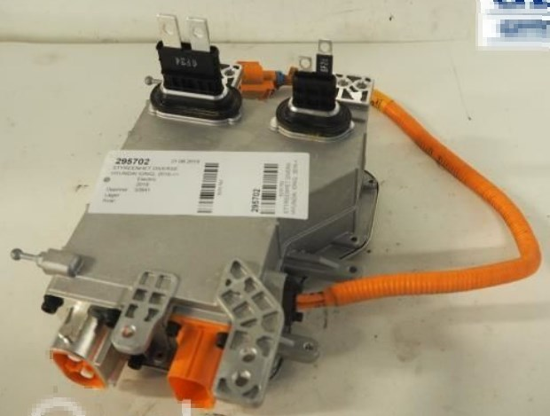
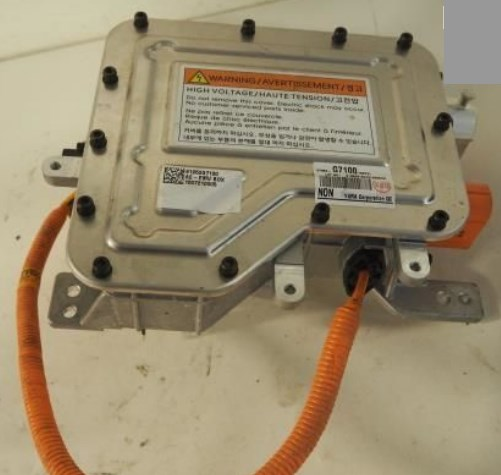

# High Voltage Junction Box

## Part numbers

The Hyundai Ioniq 28kWh high voltage junction box has the following part number:

- 91959G7100 AE - EVHV BOX

## Functionality

- HV input from the battery pack
- HV output to the inverter and LV DCDC
- HV input from the OBC
- HV output to the PTC heater
- HV output to the clima compressor

## Pictures

