# VESS

Reads the speed and the gear selection from CAN, and sends an engine sound and reverse-bing to a speaker

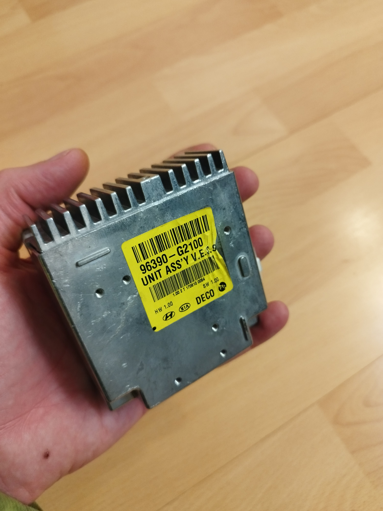
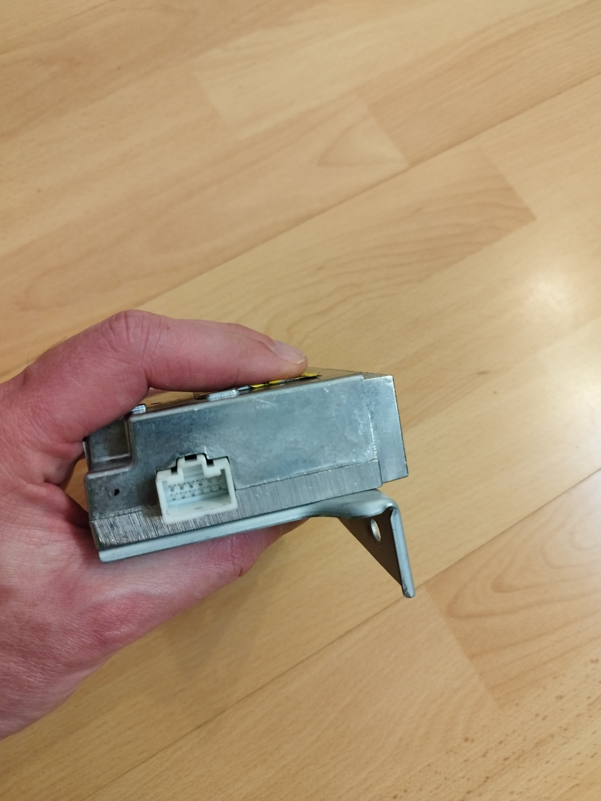
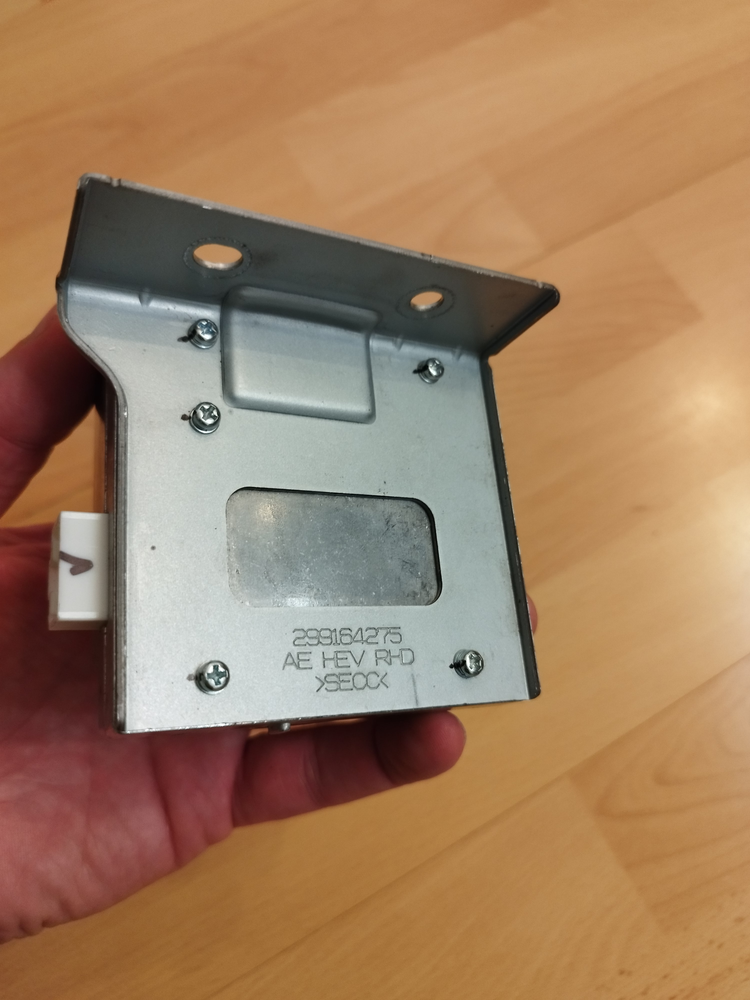
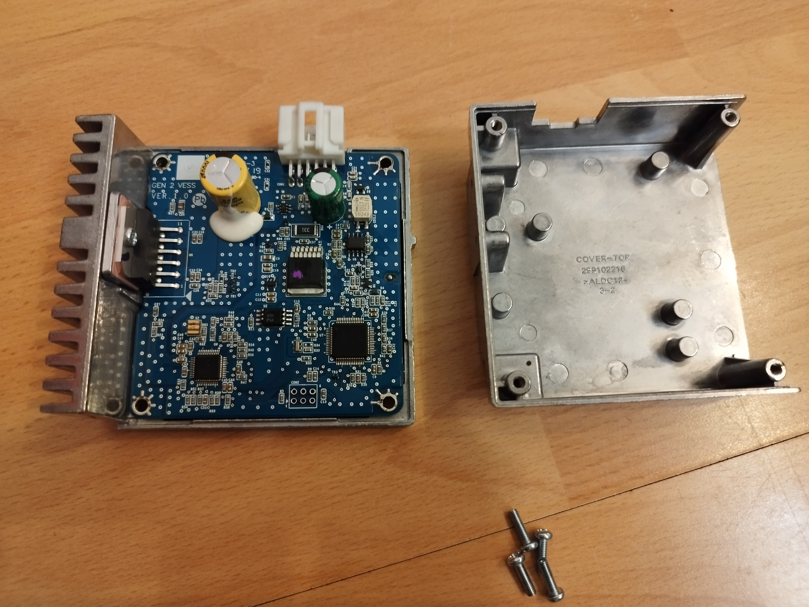
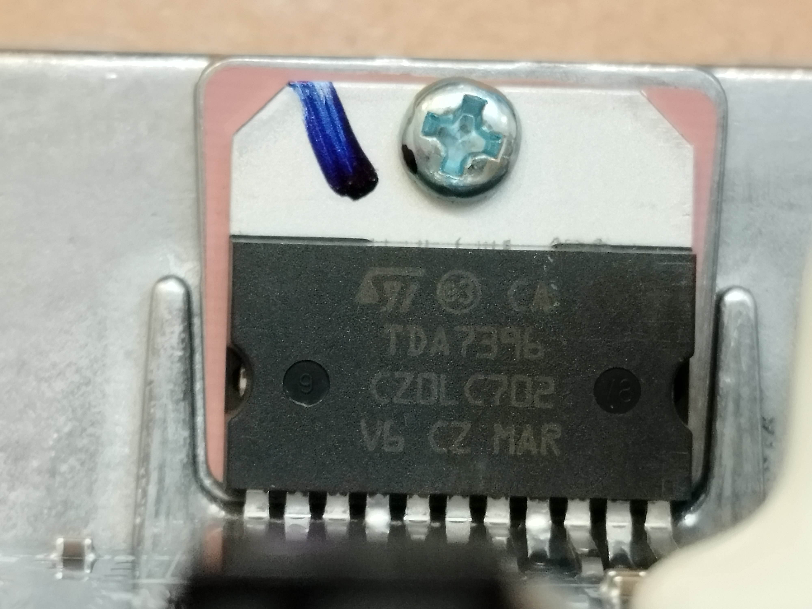
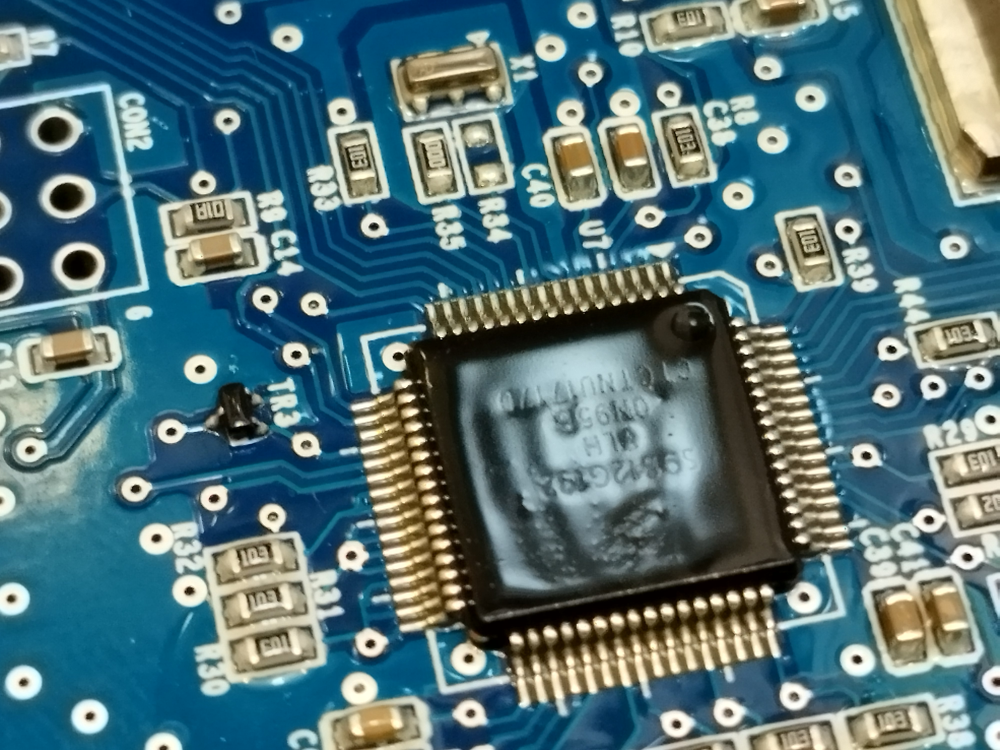

YAMAHA YMF827B see Ref6
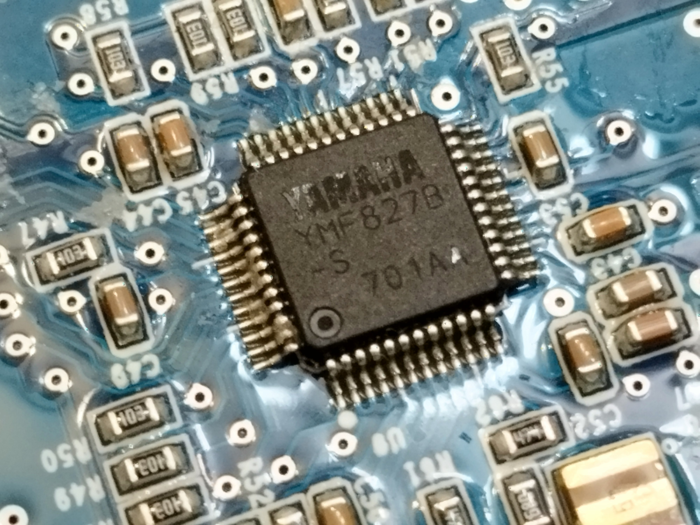

SPI Flash SPANSION FL116 KVF01 (or KVE01?) S25FL116K 16 MBit see Ref5
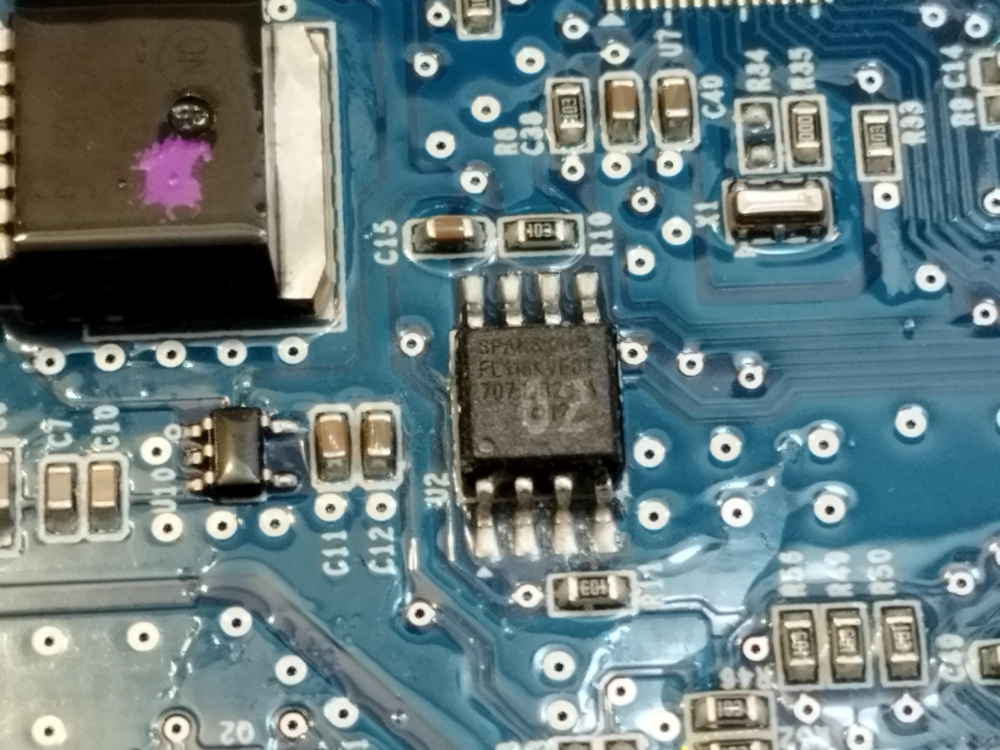

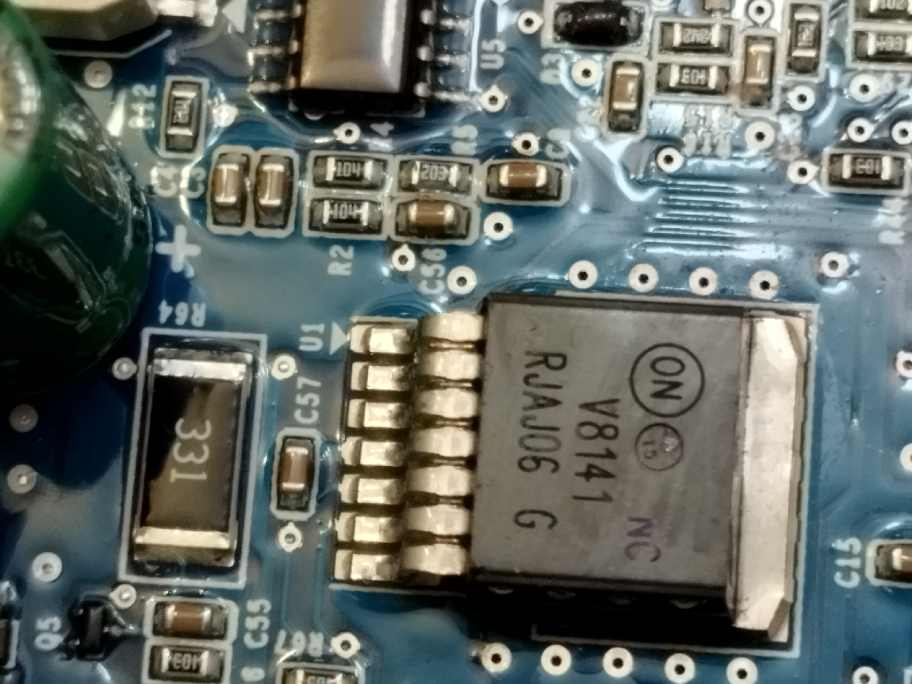
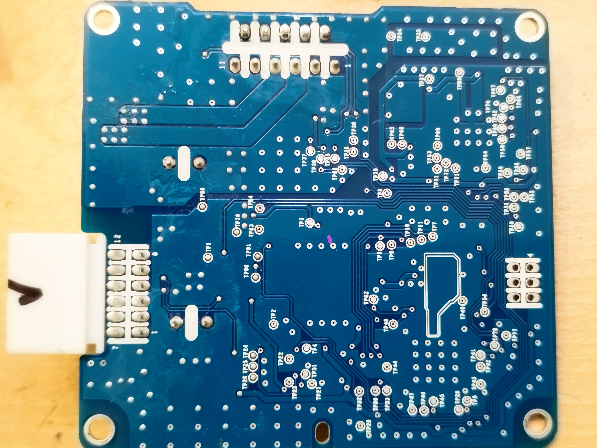
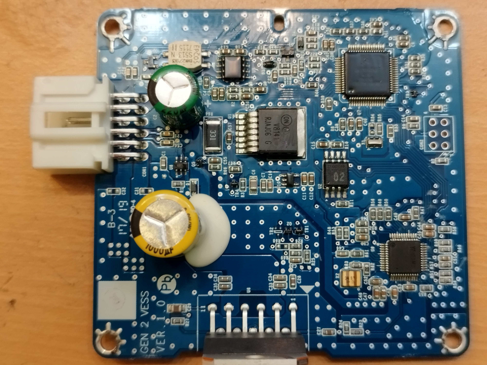


## Harness Connector

- 2x6 pin

- 1 (green) PCAN L
- 2 (orange) PCAN H
- 3 (black) ground
- 4 (vio) VESS button to ground
- 5 (red) +12V
- 6 (white) VESS speaker +
- 7 nc (on PCB, this is connected to RXD0 of the microcontroller via protection circuits)
- 8 nc (on PCB, this is routed to TXD0 of the microcontroller via protection circuits)
- 9 (black) ground
- 10 nc
- 11 (blue) VESS LED to ground
- 12 (brown) VESS speaker -

## How to find / unmount it in the car?

- Turn and pull the two stoppers of the glove box.
- Pull the two hinge bolts of the glove box. Now the glovebox can be removed.
- Behind the glove box there are two silver screws (10mm wrench). Remove these.
- Under the glove box there is a kind of "flap" which can be moved downwards. It covers a kind of filter fleece.
- On the passenger side entry, pull-off the door sealing in the front area.
- Remove the side wall of the dashboard (just pull).
- Looking from sidewards, find and remove 3 or 4 black Philips screws which hold the parts of the dashboard together.
- Unclipse the small dashboard bar, to find and remove 3 more black Philips screws, which connect the "glovebox environment part" to the upper part of the dashboard.
- Now the "glovebox environment part" is free to be unclipsed and removed.
- Two nuts (10mm wrench) are holding the VESS.
- To unlock the connector, press the black "button" heavily.
Summary: ~11 Screws/nuts in total.

## CAN communication

The VESS transmits on CAN with 500kBaud.
It sends the message 5E3, 8 bytes, all zero. Cycle time is 1 second. This is the same as observed on the Kona in Ref1.

According Ref1, the Kona VESS needs just these messages to provide a sound:
```
200 : 00 28 00 10 00 3B D0 00 for gear
524 : 60 01 02 40 5A 01 C0 02 for speed
```
The Ioniq VESS with software 1.00 is still silent, if we sent these messages with 100ms cycle time. This software version does not even play any sound if installed to the 2018 vehicle.

The Ioniq VESS with software 1.01 plays perfectly on the desk, just connecting a speaker and SavvyCAN with the script [script_VESS_play.js](../CAN/script_VESS_play.js).

Measurements on the original car:
* 0x200 byte 1 is gear:
    * P 0x80
    * D 0xA8
    * N 0xB0
    * R 0xB8
* 0x524
    * byte 2 and 3 are speed. Always positive.
    * byte 6 is speed with sign. Reverse is negative.

### Diagnostic Communication

* Broadcast on 7DF with 02 3E 00 (Tester present) leads to 73E 02 7E 00 (positive response)
* Physical request on 736 leads to positive response on 73E.
* 02 3E 00 (Tester Present) -> 7E 00 (pos)
* 02 10 01 (Default session ) -> 50 01 (pos)
* 02 10 03 (Extended session ) -> 50 03 (pos)
* 03 22 F1 AB (read identification) -> 7F 22 31 (request out of range (Ref7))
* 01 19 (read DTCs) -> nrc 12 subFunctionNotSupported
* 03 19 02 08 (read DTC, by status mask, 8) -> 03 59 02 08 AA AA AA (pos, empty)
* 03 19 02 09 (read DTC, by status mask, 9) -> 03 59 02 09 AA AA AA (pos, empty)
* 03 19 02 0A (read DTC, by status mask, A) -> 03 7F 19 31 (request out of range)

* 22 F100 -> "060"
* 22 F187 -> first frame "963" could be the first part of the part number. Printed label 96390-G2100
* 22 F18B -> 62 F18B 20 15 10 19 or on an other (SW1.01) unit 20 16 06 08. Maybe the software compile date. It is not the unit production date, because on the print labels they say 17 06 10 for the old and 18 03 20 for the newer unit.
* 22 F193 -> "100" hardware version. On the printed label 1.00.
* 22 F195 -> "100" software version. On the printed label 1.00. Using an different VESS with SW 1.01 on the label, the F195 says "101".

* 14 ClearDTCs?
* 23 ReadMemoryByAddress?

## Microcontroller

Freescale / NXP 9S12G192VLH, 64pin. See Ref10.
192kB Flash

### How to read the controllers memory?

* Interface between BDM and USB: USBDM Programmer JS16 JM16 BDM/OSBDM OSBDM Download Debugger Emulator Downloader 48MHz USB 2.0 (JS16)
* Software: https://sourceforge.net/projects/usbdm/files/Version%204.12.1/Software/


## Power Amplifier

TDA7396
* Pin 4: CD-DIA (open collector) is low during error condition (clipping, thermal, openload, shortcut)
* Pin 8: STAND-BY high means fully operational, low means standby
* Pin 11: MUTE can be pulled to ground via series resistor for muting

## SPI Flash

The YAMAHA sound chip (Ref6) reads the sound samples from the SPI-FLASH.

### Hardware preparations for reading the SPI FLASH

How to read-out the SPI FLASH?

[2025-02-04_VESS_with_raspberry.jpg](2025-02-04_VESS_with_raspberry.jpg)
[SPI_FLASH_programming_with_Raspberry.jpg](https://github.com/uhi22/foccci/raw/main/doc/SPI_FLASH_programming_with_Raspberry.jpg)
- To have exclusive access to the SPI, we need to keep the YAMAHA in reset. Pin6 RESET_N = low. E.g. at the resistor R48. But this is actively driven by the controller, pin 17, to high. We do not want to heat the controller by working against it. So we need:
- Hold the controller in reset, by grounding the reset line of the controller (pin 4), e.g. at R8.
- Connect the MISO, MOSI, CLK, CS and ground to an raspberry pi's SPI.
- Supply the VESS. Either by applying 12V to the white connector, or by connecting the 3.3V of the Raspberry directly to the 3.3V rail of the VESS.
- On the Raspberry, run `flashrom -p linux_spi:dev=/dev/spidev0.0,spispeed=2000` which identifies the Spansion S25FL116K/S25FL216K" 2048kB.
- On the Raspberry, run `flashrom -p linux_spi:dev=/dev/spidev0.0,spispeed=2000 -r original.bin` to read the content from the SPI FLASH and store it into the file original.bin.
- Result: Reading the SPI-FLASH worked (Ref12). The content is different for the "old" SW1.00 and "new" SW1.01 unit.

### Analyzing the SPI content

Looking to the dumps in a hex editor, they seem to contain 16 bit values which continuously change. The low byte is first. For example, the start is
`00 00 d9 00 77 01 0e 02 ab 02 3f 03 d9 03 71 04`
which can be seen as 16-bit values 0000 00D9 0177 020E 02AB 033F 03D9 0471. Later, around offset 0x300, the values go negative. So this seems to be a simple signed 16 bit PCM.

Let's try whether Audacity (Ref13) is able to import this. Audacity -> File -> Import -> Raw data. Encoding "Signed 16-bit PCM". Little endian. One channel (mono). 44.1kHz.

Bingo. Audacity shows and plays the sounds. There are five sections:
* 0 to ~2.5s: "first level engine sound".
* ~2.5s to ~5.3s: "second level engine sound".
* ~3.5s to 10.484a: "third level engine sound".
* 10.484s to 13.735s: The typical Ioniq "space sound".
* 13.810s to 14.493s: The reverse driving "bing".
* 14.514s to 14.521s: One sine periode. Could be used for the "driver left vehicle while ready" beep.

Demonstration (MP3 export) [vess_ioniq_sw101_orig.mp3](vess_ioniq_sw101_orig.mp3).

In contrast, the "old" SW1.00 unit has a different layout of the samples. It does not contain the "space sound", but longer "pipe organ like" sounds.

Demonstration (MP3 export) [vess_ioniq_sw100_orig.mp3](vess_ioniq_sw100_orig.mp3).

### Is it possible to change the sound?

Yes. You need the following steps:
0. Remove the VESS from the car and open it.
1. Connect the VESS to a raspberry and power it up, as described above.
2. Read the content of the SPI flash and import it into Audacity as described above.
3. Example: In Audacity change the volume and the pitch of the reverse gear bing. Then File -> Export -> other uncompressed files -> Header: raw (headerless), Encoding signed 16-bit PCM, file name `vess_ioniq_sw101_binglower.bin`. This should give an exactly 2MByte file.
4. Use this file to flash it on the VESS: 
`flashrom -p linux_spi:dev=/dev/spidev0.0,spispeed=2000 -w vess_ioniq_sw101_binglower.bin`
5. This should show that the file is successfully flashed.
6. Disconnect the power and all the lines between Raspberry and VESS.
7. Plug the VESS back into the car.
8. Check by driving.

## References

* Ref1 Youtube and github for the Kona VESS https://youtu.be/OLT1aKdpYhs and https://github.com/ereuter/vess
* Ref2 goingelectric: installation position of VESS control unit and speaker https://www.goingelectric.de/forum/viewtopic.php?p=529521#p529521 and https://www.goingelectric.de/forum/viewtopic.php?p=540312#p540312
* Ref3 schematic of the VESS integration https://service.hyundai-motor.com/UPLOAD/data/Passenger/HY/HME/DEU/ETM-IMAGES/HY-AE22-IMAGES-DEU/eaeevsd17314ag.svg
* Ref4 internal block diagram of the VESS https://www.goingelectric.de/forum/viewtopic.php?p=540312#p540312
* Ref5 data sheet of the SPI flash https://www.mouser.com/datasheet/2/380/S25FL116K_00-274912.pdf?srsltid=AfmBOooF0maW2Ar8tsxoBHCp190RUxyHD0BjgixwFOKB7HmAxDmbMZNP
* Ref6 sound generator YAMAHA https://device.yamaha.com/en/lsi/products/sound_generator/ and data sheet [YMF827B.pdf](YMF827B.pdf)
* Ref7 UDS services and response codes https://automotive.wiki/index.php/ISO_14229
* Ref8 UDS service 19 subfunction list https://piembsystech.com/read-dtc-information-service-0x19-uds-protocol/
* Ref9 Data sheet of the power amplifier https://www.st.com/resource/en/datasheet/tda7396.pdf
* Ref10 Data sheet 9S12G family https://www.mouser.de/datasheet/2/302/MC9S12GRMV1-1359997.pdf and [MC9S12GRMV1-1359997.pdf](MC9S12GRMV1-1359997.pdf)
* Ref11 flashrom manual page https://flashrom.org/classic_cli_manpage.html
* Ref12 dumps of the SPI flash [vess_ioniq_sw100_orig.bin](vess_ioniq_sw100_orig.bin) and [vess_ioniq_sw101_orig.bin](vess_ioniq_sw101_orig.bin) and the command line log [console_log_reading_VESS_SPI_flash.txt](console_log_reading_VESS_SPI_flash.txt)
* Ref13 Audacity Free Audio Editor https://www.audacityteam.org/