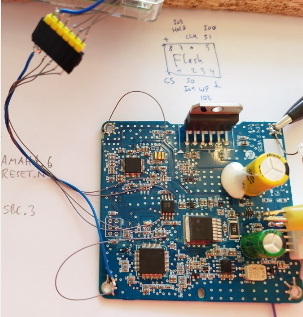

# VESS

Reads the speed and the gear selection from CAN, and sends an engine sound and reverse-bing to a speaker


YAMAHA YMF827B see Ref6


SPI Flash SPANSION FL116 KVF01 (or KVE01?) S25FL116K 16 MBit see Ref5


## Harness Connector

- 2x6 pin

- 1 (green) PCAN L
- 2 (orange) PCAN H
- 3 (black) ground
- 4 (vio) VESS button to ground
- 5 (red) +12V
- 6 (white) VESS speaker +
- 7 nc (on PCB, this is connected to RXD0 of the microcontroller via protection circuits)
- 8 nc (on PCB, this is routed to TXD0 of the microcontroller via protection circuits)
- 9 (black) ground
- 10 nc
- 11 (blue) VESS LED to ground
- 12 (brown) VESS speaker -

## How to find / unmount it in the car?

- Turn and pull the two stoppers of the glove box.
- Pull the two hinge bolts of the glove box. Now the glovebox can be removed.
- Behind the glove box there are two silver screws (10mm wrench). Remove these.
- Under the glove box there is a kind of "flap" which can be moved downwards. It covers a kind of filter fleece.
- On the passenger side entry, pull-off the door sealing in the front area.
- Remove the side wall of the dashboard (just pull).
- Looking from sidewards, find and remove 3 or 4 black Philips screws which hold the parts of the dashboard together.
- Unclipse the small dashboard bar, to find and remove 3 more black Philips screws, which connect the "glovebox environment part" to the upper part of the dashboard.
- Now the "glovebox environment part" is free to be unclipsed and removed.
- Two nuts (10mm wrench) are holding the VESS.
- To unlock the connector, press the black "button" heavily.

Summary: ~11 Screws/nuts in total.

## CAN communication

The VESS transmits on CAN with 500kBaud.
It sends the message 5E3, 8 bytes, all zero. Cycle time is 1 second. This is the same as observed on the Kona in Ref1.

According Ref1, the Kona VESS needs just these messages to provide a sound:
```
200 : 00 28 00 10 00 3B D0 00 for gear
524 : 60 01 02 40 5A 01 C0 02 for speed
```
The Ioniq VESS with software 1.00 is still silent, if we sent these messages with 100ms cycle time. This software version does not even play any sound if installed to the 2018 vehicle.

The Ioniq VESS with software 1.01 plays perfectly on the desk, just connecting a speaker and SavvyCAN with the script [script_VESS_play.js](../CAN/script_VESS_play.js).

Measurements on the original car:
* 0x200 byte 1 is gear:
    * P 0x80
    * D 0xA8
    * N 0xB0
    * R 0xB8
* 0x524
    * byte 2 and 3 are speed. Always positive.
    * byte 6 is speed with sign. Reverse is negative.

### Diagnostic Communication

* Broadcast on 7DF with 02 3E 00 (Tester present) leads to 73E 02 7E 00 (positive response)
* Physical request on 736 leads to positive response on 73E.
* 02 3E 00 (Tester Present) -> 7E 00 (pos)
* 02 10 01 (Default session ) -> 50 01 (pos)
* 02 10 03 (Extended session ) -> 50 03 (pos)
* 03 22 F1 AB (read identification) -> 7F 22 31 (request out of range (Ref7))
* 01 19 (read DTCs) -> nrc 12 subFunctionNotSupported
* 03 19 02 08 (read DTC, by status mask, 8) -> 03 59 02 08 AA AA AA (pos, empty)
* 03 19 02 09 (read DTC, by status mask, 9) -> 03 59 02 09 AA AA AA (pos, empty)
* 03 19 02 0A (read DTC, by status mask, A) -> 03 7F 19 31 (request out of range)

* 22 F100 -> "060"
* 22 F187 -> first frame "963" could be the first part of the part number. Printed label 96390-G2100
* 22 F18B -> 62 F18B 20 15 10 19 or on an other (SW1.01) unit 20 16 06 08. Maybe the software compile date. It is not the unit production date, because on the print labels they say 17 06 10 for the old and 18 03 20 for the newer unit.
* 22 F193 -> "100" hardware version. On the printed label 1.00.
* 22 F195 -> "100" software version. On the printed label 1.00. Using an different VESS with SW 1.01 on the label, the F195 says "101".

* 14 ClearDTCs?
* 23 ReadMemoryByAddress?

## Microcontroller

Freescale / NXP 9S12G192VLH, 64pin. See Ref10.
192kB Flash

### How to read the controllers memory?

* Interface between BDM and USB: USBDM Programmer JS16 JM16 BDM/OSBDM OSBDM Download Debugger Emulator Downloader 48MHz USB 2.0 (JS16)
* Software: https://sourceforge.net/projects/usbdm/files/Version%204.12.1/Software/
    * Download and check the readme: ReadMe Software.md
    * Download the USB driver. Which version? Trying USBDM_Drivers_4_12_3_Win_x64.msi which is listet for Win7, under Win10.
    * Install the USB driver.
    * Downloading USBDM_4_12_1_330_Win.msi. Windows complains that this is not secure.
    * Install USBDM_4_12_1_330_Win.msi
    * USBDM hardware manual https://usbdm.sourceforge.io/USBDM_V4.12/html/index.html
    * USBDM flash programmer software manual https://usbdm.sourceforge.io/USBDM_V4.12/USBDM_FlashProgrammers/html/index.html
    * Hardware setup:
        * Open the USBDM and set the jumper to 3.3V. Make sure that the BDM connector has 3.3V, not 5V, before connecting to the target.
        * Solder a 6-pin-header to the VESS. Connect the USBDM to the VESS.
        * Connect 12V to the VESS, otherwise the SBC holds the controller in reset and the USBDM cannot establish a connection.    
    * wrong: Navigate to C:\Program Files\pgo\USBDM 4.12.1.330 and start UsbdmFlashProgrammer.exe
    * better: UsbdmMemoryDump.exe. Select HCS12. Enter memory range (see below) and width (1), press ReadMemory and SafeToFile.
    * memory range:  EEPROM is at 400 to 13FF. Program flash is from 10000 to 3FFFF (according to Ref10).
    * result: vess_maincontroller_v1.0_eeprom_and_flash.s19
    * maybe this is broken, due to not reflecting the paged memory structure
    * Explanation of the paging: https://community.nxp.com/t5/OSBDM-and-TBDML/USBDM-and-HCS12-9S12D64-read-write-problems/td-p/501003

    * memory range:  EEPROM is at 400 to 13FF. Program flash is from 10000 to 3FFFF (according to Ref10).
    * width 2
    * x Global (linear) addressing
    * also this gives wrong results, e.g. a mass erased flash is partly reported as not erased.
```
```

    * next try: use the paged access. "x Page Flash", PPAGE reg address = 15 (means 15hex).
    * 4000 to 7FFF (fix page)
    * C000 to FFFF (fix page)
    * 018000 to 01BFFF (page 01 in 16k window at 8000)
    * 028000 to 02BFFF (page 02 in 16k window at 8000)
    * and so on, until page 0F (according to Ref10, Figure 5-11, Local to Global Address Mapping)
    
Using a mass-erased unit, this shows in the log window:
```
Creating Empty flash image...
Interface options: HCS12, , speed = 250
Using paged flash addresses (PPAGE address=0x15)
Using Memory space = 
Reading memory-block[0x000400, 0x0013FF, 2]...Blank
Using Memory space = 
Reading memory-block[0x004000, 0x004FFF, 2]...Blank
Reading memory-block[0x005000, 0x005FFF, 2]...Blank
Reading memory-block[0x006000, 0x006FFF, 2]...Blank
Reading memory-block[0x007000, 0x007FFF, 2]...Blank
Using Memory space = 
Reading memory-block[0x00C000, 0x00CFFF, 2]...Blank
Reading memory-block[0x00D000, 0x00DFFF, 2]...Blank
Reading memory-block[0x00E000, 0x00EFFF, 2]...Blank
Reading memory-block[0x00F000, 0x00FFFF, 2]...Blank
Using Memory space = 
Writing PPAGE(0x0015) = 0x01
Reading memory-block[0x01:8000, 0x01:8FFF, 2]...Blank
Reading memory-block[0x01:9000, 0x01:9FFF, 2]...Blank
Reading memory-block[0x01:A000, 0x01:AFFF, 2]...Blank
Reading memory-block[0x01:B000, 0x01:BFFF, 2]...Blank
Using Memory space = 
Writing PPAGE(0x0015) = 0x02
Reading memory-block[0x02:8000, 0x02:8FFF, 2]...Blank
Reading memory-block[0x02:9000, 0x02:9FFF, 2]...Blank
Reading memory-block[0x02:A000, 0x02:AFFF, 2]...Blank
Reading memory-block[0x02:B000, 0x02:BFFF, 2]...Blank
Using Memory space = 
Writing PPAGE(0x0015) = 0x03
Reading memory-block[0x03:8000, 0x03:8FFF, 2]...Blank
Reading memory-block[0x03:9000, 0x03:9FFF, 2]...Blank
Reading memory-block[0x03:A000, 0x03:AFFF, 2]...Blank
Reading memory-block[0x03:B000, 0x03:BFFF, 2]...Blank
Using Memory space = 
Writing PPAGE(0x0015) = 0x04
Reading memory-block[0x04:8000, 0x04:8FFF, 2]...Blank
Reading memory-block[0x04:9000, 0x04:9FFF, 2]...Blank
Reading memory-block[0x04:A000, 0x04:AFFF, 2]...Blank
Reading memory-block[0x04:B000, 0x04:BFFF, 2]...Blank
Using Memory space = 
Writing PPAGE(0x0015) = 0x05
Reading memory-block[0x05:8000, 0x05:8FFF, 2]...Blank
Reading memory-block[0x05:9000, 0x05:9FFF, 2]...Blank
Reading memory-block[0x05:A000, 0x05:AFFF, 2]...Blank
Reading memory-block[0x05:B000, 0x05:BFFF, 2]...Blank
Using Memory space = 
Writing PPAGE(0x0015) = 0x06
Reading memory-block[0x06:8000, 0x06:8FFF, 2]...Blank
Reading memory-block[0x06:9000, 0x06:9FFF, 2]...Blank
Reading memory-block[0x06:A000, 0x06:AFFF, 2]...Blank
Reading memory-block[0x06:B000, 0x06:BFFF, 2]...Blank
Using Memory space = 
Writing PPAGE(0x0015) = 0x07
Reading memory-block[0x07:8000, 0x07:8FFF, 2]...Blank
Reading memory-block[0x07:9000, 0x07:9FFF, 2]...Blank
Reading memory-block[0x07:A000, 0x07:AFFF, 2]...Blank
Reading memory-block[0x07:B000, 0x07:BFFF, 2]...Blank
Using Memory space = 
Writing PPAGE(0x0015) = 0x08
Reading memory-block[0x08:8000, 0x08:8FFF, 2]...Blank
Reading memory-block[0x08:9000, 0x08:9FFF, 2]...Blank
Reading memory-block[0x08:A000, 0x08:AFFF, 2]...Blank
Reading memory-block[0x08:B000, 0x08:BFFF, 2]...Blank
Using Memory space = 
Writing PPAGE(0x0015) = 0x09
Reading memory-block[0x09:8000, 0x09:8FFF, 2]...Blank
Reading memory-block[0x09:9000, 0x09:9FFF, 2]...Blank
Reading memory-block[0x09:A000, 0x09:AFFF, 2]...Blank
Reading memory-block[0x09:B000, 0x09:BFFF, 2]...Blank
Using Memory space = 
Writing PPAGE(0x0015) = 0x0A
Reading memory-block[0x0A:8000, 0x0A:8FFF, 2]...Blank
Reading memory-block[0x0A:9000, 0x0A:9FFF, 2]...Blank
Reading memory-block[0x0A:A000, 0x0A:AFFF, 2]...Blank
Reading memory-block[0x0A:B000, 0x0A:BFFF, 2]...Blank
Using Memory space = 
Writing PPAGE(0x0015) = 0x0B
Reading memory-block[0x0B:8000, 0x0B:8FFF, 2]...Blank
Reading memory-block[0x0B:9000, 0x0B:9FFF, 2]...Blank
Reading memory-block[0x0B:A000, 0x0B:AFFF, 2]...Blank
Reading memory-block[0x0B:B000, 0x0B:BFFF, 2]...Blank
Using Memory space = 
Writing PPAGE(0x0015) = 0x0C
Reading memory-block[0x0C:8000, 0x0C:8FFF, 2]...Blank
Reading memory-block[0x0C:9000, 0x0C:9FFF, 2]...Blank
Reading memory-block[0x0C:A000, 0x0C:AFFF, 2]...Blank
Reading memory-block[0x0C:B000, 0x0C:BFFF, 2]...Blank
Using Memory space = 
Writing PPAGE(0x0015) = 0x0D
Reading memory-block[0x0D:8000, 0x0D:8FFF, 2]...Blank
Reading memory-block[0x0D:9000, 0x0D:9FFF, 2]...Blank
Reading memory-block[0x0D:A000, 0x0D:AFFF, 2]...Blank
Reading memory-block[0x0D:B000, 0x0D:BFFF, 2]...Blank
Using Memory space = 
Writing PPAGE(0x0015) = 0x0E
Reading memory-block[0x0E:8000, 0x0E:8FFF, 2]...Blank
Reading memory-block[0x0E:9000, 0x0E:9FFF, 2]...Blank
Reading memory-block[0x0E:A000, 0x0E:AFFF, 2]...Blank
Reading memory-block[0x0E:B000, 0x0E:BFFF, 2]...Blank
Using Memory space = 
Writing PPAGE(0x0015) = 0x0F
Reading memory-block[0x0F:8000, 0x0F:8FFF, 2]...Blank
Reading memory-block[0x0F:9000, 0x0F:9FFF, 2]...Blank
Reading memory-block[0x0F:A000, 0x0F:AFFF, 2]...Blank
Reading memory-block[0x0F:B000, 0x0F:BFFF, 2]...Blank
Done
```

Using the original SW 1.1 unit, we get

```
Creating Empty flash image...
Interface options: HCS12, , speed = 250
Using paged flash addresses (PPAGE address=0x15)
Using Memory space = 
Reading memory-block[0x000400, 0x0013FF, 2]...
Using Memory space = 
Reading memory-block[0x004000, 0x004FFF, 2]...
Reading memory-block[0x005000, 0x005FFF, 2]...Blank
Reading memory-block[0x006000, 0x006FFF, 2]...Blank
Reading memory-block[0x007000, 0x007FFF, 2]...
Using Memory space = 
Reading memory-block[0x00C000, 0x00CFFF, 2]...
Reading memory-block[0x00D000, 0x00DFFF, 2]...
Reading memory-block[0x00E000, 0x00EFFF, 2]...
Reading memory-block[0x00F000, 0x00FFFF, 2]...
Using Memory space = 
Writing PPAGE(0x0015) = 0x01
Reading memory-block[0x01:8000, 0x01:8FFF, 2]...Blank
Reading memory-block[0x01:9000, 0x01:9FFF, 2]...Blank
Reading memory-block[0x01:A000, 0x01:AFFF, 2]...Blank
Reading memory-block[0x01:B000, 0x01:BFFF, 2]...Blank
Using Memory space = 
Writing PPAGE(0x0015) = 0x02
Reading memory-block[0x02:8000, 0x02:8FFF, 2]...Blank
Reading memory-block[0x02:9000, 0x02:9FFF, 2]...Blank
Reading memory-block[0x02:A000, 0x02:AFFF, 2]...Blank
Reading memory-block[0x02:B000, 0x02:BFFF, 2]...Blank
Using Memory space = 
Writing PPAGE(0x0015) = 0x03
Reading memory-block[0x03:8000, 0x03:8FFF, 2]...Blank
Reading memory-block[0x03:9000, 0x03:9FFF, 2]...Blank
Reading memory-block[0x03:A000, 0x03:AFFF, 2]...Blank
Reading memory-block[0x03:B000, 0x03:BFFF, 2]...Blank
Using Memory space = 
Writing PPAGE(0x0015) = 0x04
Reading memory-block[0x04:8000, 0x04:8FFF, 2]...
Reading memory-block[0x04:9000, 0x04:9FFF, 2]...
Reading memory-block[0x04:A000, 0x04:AFFF, 2]...
Reading memory-block[0x04:B000, 0x04:BFFF, 2]...
Using Memory space = 
Writing PPAGE(0x0015) = 0x05
Reading memory-block[0x05:8000, 0x05:8FFF, 2]...
Reading memory-block[0x05:9000, 0x05:9FFF, 2]...
Reading memory-block[0x05:A000, 0x05:AFFF, 2]...Blank
Reading memory-block[0x05:B000, 0x05:BFFF, 2]...Blank
Using Memory space = 
Writing PPAGE(0x0015) = 0x06
Reading memory-block[0x06:8000, 0x06:8FFF, 2]...Blank
Reading memory-block[0x06:9000, 0x06:9FFF, 2]...Blank
Reading memory-block[0x06:A000, 0x06:AFFF, 2]...Blank
Reading memory-block[0x06:B000, 0x06:BFFF, 2]...Blank
Using Memory space = 
Writing PPAGE(0x0015) = 0x07
Reading memory-block[0x07:8000, 0x07:8FFF, 2]...Blank
Reading memory-block[0x07:9000, 0x07:9FFF, 2]...Blank
Reading memory-block[0x07:A000, 0x07:AFFF, 2]...Blank
Reading memory-block[0x07:B000, 0x07:BFFF, 2]...Blank
Using Memory space = 
Writing PPAGE(0x0015) = 0x08
Reading memory-block[0x08:8000, 0x08:8FFF, 2]...Blank
Reading memory-block[0x08:9000, 0x08:9FFF, 2]...Blank
Reading memory-block[0x08:A000, 0x08:AFFF, 2]...Blank
Reading memory-block[0x08:B000, 0x08:BFFF, 2]...Blank
Using Memory space = 
Writing PPAGE(0x0015) = 0x09
Reading memory-block[0x09:8000, 0x09:8FFF, 2]...Blank
Reading memory-block[0x09:9000, 0x09:9FFF, 2]...Blank
Reading memory-block[0x09:A000, 0x09:AFFF, 2]...Blank
Reading memory-block[0x09:B000, 0x09:BFFF, 2]...Blank
Using Memory space = 
Writing PPAGE(0x0015) = 0x0A
Reading memory-block[0x0A:8000, 0x0A:8FFF, 2]...Blank
Reading memory-block[0x0A:9000, 0x0A:9FFF, 2]...Blank
Reading memory-block[0x0A:A000, 0x0A:AFFF, 2]...Blank
Reading memory-block[0x0A:B000, 0x0A:BFFF, 2]...Blank
Using Memory space = 
Writing PPAGE(0x0015) = 0x0B
Reading memory-block[0x0B:8000, 0x0B:8FFF, 2]...Blank
Reading memory-block[0x0B:9000, 0x0B:9FFF, 2]...Blank
Reading memory-block[0x0B:A000, 0x0B:AFFF, 2]...Blank
Reading memory-block[0x0B:B000, 0x0B:BFFF, 2]...Blank
Using Memory space = 
Writing PPAGE(0x0015) = 0x0C
Reading memory-block[0x0C:8000, 0x0C:8FFF, 2]...Blank
Reading memory-block[0x0C:9000, 0x0C:9FFF, 2]...Blank
Reading memory-block[0x0C:A000, 0x0C:AFFF, 2]...Blank
Reading memory-block[0x0C:B000, 0x0C:BFFF, 2]...
Using Memory space = 
Writing PPAGE(0x0015) = 0x0D
Reading memory-block[0x0D:8000, 0x0D:8FFF, 2]...
Reading memory-block[0x0D:9000, 0x0D:9FFF, 2]...Blank
Reading memory-block[0x0D:A000, 0x0D:AFFF, 2]...Blank
Reading memory-block[0x0D:B000, 0x0D:BFFF, 2]...
Using Memory space = 
Writing PPAGE(0x0015) = 0x0E
Reading memory-block[0x0E:8000, 0x0E:8FFF, 2]...
Reading memory-block[0x0E:9000, 0x0E:9FFF, 2]...
Reading memory-block[0x0E:A000, 0x0E:AFFF, 2]...
Reading memory-block[0x0E:B000, 0x0E:BFFF, 2]...
Using Memory space = 
Writing PPAGE(0x0015) = 0x0F
Reading memory-block[0x0F:8000, 0x0F:8FFF, 2]...
Reading memory-block[0x0F:9000, 0x0F:9FFF, 2]...
Reading memory-block[0x0F:A000, 0x0F:AFFF, 2]...
Reading memory-block[0x0F:B000, 0x0F:BFFF, 2]...
Done
```

The pages 0x0D and 0x0F are also visible in the fix areas at 0x4000 and 0xC000, so using the above configuration, we have them
twice in the s19 file. Could be optimized.

Manually cutted s19 file which contains only the relevant parts and no duplicates: vess_v1.1_eeprom_and_flash_pagedRead_only_relevantparts.s19

#### Content of the microcontrollers flash

At 0xC000 there seems to be a boot loader, which is controlled via a serial terminal. We find a lot of strings there. This maybe offers the possibility to update the software and the sounds just using a serial interface.

```
==================== VESS BIOS ===================
=  PROG Name	: %s 	
VESS_BOOTLOADER
=  PROG Ver	: %s 	
REV 1.00.09
=  Start Date	: %s 	
2013/10/23
=  UpGrade Date	: %s 	
2015/09/20
=------------------------------------------------= 
==================== HELP MENU =================== 
=  HM  : HELP MENU                               = 
=  PI  : PROGRAM INFORMATION                     = 
=------------------------------------------------= 
=  EB  : EEPROM ERASE ALL BLOCK                  = 
=  EC  : EEPROM SAVE DATA CHECK                  = 
=------------------------------------------------= 
=  SC  : S_FLASH CAPACITY CHECK                  = 
=  PR  : S_FLASH PAGE READ                       = 
=------------------------------------------------= 
=  SE  : S_FLASH ERASE                           = 
=  SD  : S_FLASH SOUND DOWNLOAD                  = 
=------------------------------------------------= 
=  AE  : P_FLASH APPLICATION ERASE               = 
=  AR  : P_FLASH APPLICATION REPROGRAM           = 
=------------------------------------------------= 
=  QM  : QUIT BOOTLOADER(RUN APPLICATION)        = 
================== TYPE HM HELP ================== 
[BOOTLOADER]	[CMD] VESS BOOT : 
[BOOTLOADER]	[ERROR] BOOT COMMAND ERROR!!
================= APPLICATION  INFO ==============
=  APP Target	: APPLICATION ERROR!!!
=  APP Target	: %s
=  APP Ver	: APPLICATION ERROR!!!
=  APP Ver	: REV %c.%c%c.%c%c 
=------------------------------------------------= 
[BOOTLOADER]	[SD] SFlash ÃʱâÈ­(SE)¸¦ ¸ÕÀú ½ÇÇà ÇϽʽÿä...!!
[BOOTLOADER]	[SD] XMODEM ¹æ½ÄÀ¸·Î À½¿ø Data¸¦ Download ¹Þ½À´Ï´Ù...
[BOOTLOADER]	[SD] XMODEM À» ½ÇÇà ½ÃÄÑ ÁֽʽÿÀ...
[BOOTLOADER]	[AR] IFLASH APPLICATION ERASE(AE)¸¦ ¸ÕÀú ½ÇÇà ÇϽʽÿä...!!
[BOOTLOADER]	[AR] XMODEM ¹æ½ÄÀ¸·Î APPLICATION Data¸¦ Download ¹Þ½À´Ï´Ù...
[BOOTLOADER]	[AR] XMODEM À» ½ÇÇà ½ÃÄÑ ÁֽʽÿÀ...
[BOOTLOADER]	[AR] Application Reprogramming SUCCESS..!!! 
[BOOTLOADER]	[AR] Application Reprogramming FAIL...!!! 
[BOOTLOADER]	[QM] RUN AP
```


### How to write a different software version into the controller?

To update a VESS with from the old software 1.0 to the new 1.1, we can use the following procedure:

* Connect USBDM via USB to the windows PC.
* Connect USBDM to the VESS via the 6-pin header.
* Connect 12V to the VESS.
* Disable the watchdog, by pulling TP83 to ground via 10k. Disabling the watchdog is necessary, because otherwise it will reset the controller during programming, which leads corrupted memory. The disabling of the watchdog must be done AFTER the VESS is powered, because otherwise the SBC will enter a kind of emergency mode and hold the reset line low all the time.
* Windows start menu -> HCS12 Programmer (which is a link to "C:\Program Files\pgo\USBDM 4.12.1.330\". Same as "UsbdmFlashProgrammer.exe -target=HCS12"
* "Load Hex File" vess_v1.1_eeprom_and_flash_pagedRead_only_relevantparts.s19
* Select controller MC9S12G192. Using "Detect chip" the list is filtered by chip ID, which should also include the G192.
* Set security to "unsecure"
* Push "Mass Erase Now" to erase.
* Set erase mode to "EraseAll", to erase everything before programming the new image. (maybe this is redundant)
* Push "Program Flash", this should run without error.
* Push "Verify Flash", this should show no deviations.
* Remove the ground connection of TP83. This lets the watchdog run and produce a single reset pulse.
* The controller starts up, and turns the VESS light on.


## Power Amplifier

TDA7396
* Pin 4: CD-DIA (open collector) is low during error condition (clipping, thermal, openload, shortcut)
* Pin 8: STAND-BY high means fully operational, low means standby
* Pin 11: MUTE can be pulled to ground via series resistor for muting

## SPI Flash

The YAMAHA sound chip (Ref6) reads the sound samples from the SPI-FLASH.

### Hardware preparations for reading the SPI FLASH

How to read-out the SPI FLASH?



- To have exclusive access to the SPI, we need to keep the YAMAHA in reset. Pin6 RESET_N = low. E.g. at the resistor R48. But this is actively driven by the controller, pin 17, to high. We do not want to heat the controller by working against it. So we need:
- Hold the controller in reset, by grounding the reset line of the controller (pin 4), e.g. at R8.
- Connect the MISO, MOSI, CLK, CS and ground to an raspberry pi's SPI.
- Supply the VESS. Either by applying 12V to the white connector, or by connecting the 3.3V of the Raspberry directly to the 3.3V rail of the VESS.
- On the Raspberry, run `flashrom -p linux_spi:dev=/dev/spidev0.0,spispeed=2000` which identifies the Spansion S25FL116K/S25FL216K" 2048kB.
- On the Raspberry, run `flashrom -p linux_spi:dev=/dev/spidev0.0,spispeed=2000 -r original.bin` to read the content from the SPI FLASH and store it into the file original.bin.
- Result: Reading the SPI-FLASH worked (Ref12). The content is different for the "old" SW1.00 and "new" SW1.01 unit.

### Analyzing the SPI content

Looking to the dumps in a hex editor, they seem to contain 16 bit values which continuously change. The low byte is first. For example, the start is
`00 00 d9 00 77 01 0e 02 ab 02 3f 03 d9 03 71 04`
which can be seen as 16-bit values 0000 00D9 0177 020E 02AB 033F 03D9 0471. Later, around offset 0x300, the values go negative. So this seems to be a simple signed 16 bit PCM.

Let's try whether Audacity (Ref13) is able to import this. Audacity -> File -> Import -> Raw data. Encoding "Signed 16-bit PCM". Little endian. One channel (mono). 44.1kHz.

Bingo. Audacity shows and plays the sounds. There are five sections:
* 0 to ~2.5s: "first level engine sound".
* ~2.5s to ~5.3s: "second level engine sound".
* ~3.5s to 10.484a: "third level engine sound".
* 10.484s to 13.735s: The typical Ioniq "space sound".
* 13.810s to 14.493s: The reverse driving "bing".
* 14.514s to 14.521s: One sine periode. Could be used for the "driver left vehicle while ready" beep.

Demonstration (MP3 export) [vess_ioniq_sw101_orig.mp3](vess_ioniq_sw101_orig.mp3).

In contrast, the "old" SW1.00 unit has a different layout of the samples. It does not contain the "space sound", but longer "pipe organ like" sounds.

Demonstration (MP3 export) [vess_ioniq_sw100_orig.mp3](vess_ioniq_sw100_orig.mp3).

### Is it possible to change the sound?

Yes. You need the following steps:

1. Remove the VESS from the car and open it.
2. Connect the VESS to a raspberry and power it up, as described above.
3. Read the content of the SPI flash and import it into Audacity as described above.
4. Example: In Audacity change the volume and the pitch of the reverse gear bing. Then File -> Export -> other uncompressed files -> Header: raw (headerless), Encoding signed 16-bit PCM, file name `vess_ioniq_sw101_binglower.bin`. This should give an exactly 2MByte file.
5. Use this file to flash it on the VESS: 
`flashrom -p linux_spi:dev=/dev/spidev0.0,spispeed=2000 -w vess_ioniq_sw101_binglower.bin`
6. This should show that the file is successfully flashed.
7. Disconnect the power and all the lines between Raspberry and VESS.
8. Plug the VESS back into the car.
9. Check the sound by driving.

## References

* Ref1 Youtube and github for the Kona VESS https://youtu.be/OLT1aKdpYhs and https://github.com/ereuter/vess
* Ref2 goingelectric: installation position of VESS control unit and speaker https://www.goingelectric.de/forum/viewtopic.php?p=529521#p529521 and https://www.goingelectric.de/forum/viewtopic.php?p=540312#p540312
* Ref3 schematic of the VESS integration https://service.hyundai-motor.com/UPLOAD/data/Passenger/HY/HME/DEU/ETM-IMAGES/HY-AE22-IMAGES-DEU/eaeevsd17314ag.svg
* Ref4 internal block diagram of the VESS https://www.goingelectric.de/forum/viewtopic.php?p=540312#p540312
* Ref5 data sheet of the SPI flash https://www.mouser.com/datasheet/2/380/S25FL116K_00-274912.pdf?srsltid=AfmBOooF0maW2Ar8tsxoBHCp190RUxyHD0BjgixwFOKB7HmAxDmbMZNP
* Ref6 sound generator YAMAHA https://device.yamaha.com/en/lsi/products/sound_generator/ and data sheet [YMF827B.pdf](YMF827B.pdf)
* Ref7 UDS services and response codes https://automotive.wiki/index.php/ISO_14229
* Ref8 UDS service 19 subfunction list https://piembsystech.com/read-dtc-information-service-0x19-uds-protocol/
* Ref9 Data sheet of the power amplifier https://www.st.com/resource/en/datasheet/tda7396.pdf
* Ref10 Data sheet 9S12G family https://www.mouser.de/datasheet/2/302/MC9S12GRMV1-1359997.pdf and [MC9S12GRMV1-1359997.pdf](MC9S12GRMV1-1359997.pdf)
* Ref11 flashrom manual page https://flashrom.org/classic_cli_manpage.html
* Ref12 dumps of the SPI flash [vess_ioniq_sw100_orig.bin](vess_ioniq_sw100_orig.bin) and [vess_ioniq_sw101_orig.bin](vess_ioniq_sw101_orig.bin) and the command line log [console_log_reading_VESS_SPI_flash.txt](console_log_reading_VESS_SPI_flash.txt)
* Ref13 Audacity Free Audio Editor https://www.audacityteam.org/