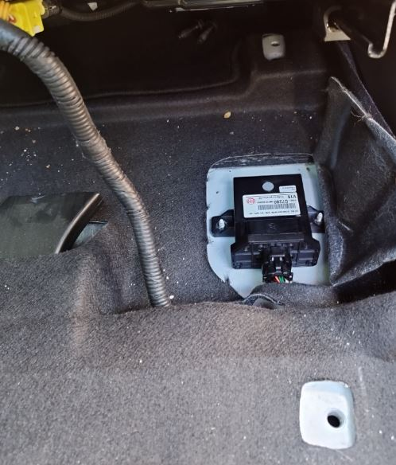

# Hyundai Ioniq (2018) investigations

## What PLC chip is used?

QCA7005.
The software version is MAC-QCA7005-1.1.0.730-04-20140815-CS (found by sending GetSwVersion).

## Which module contains the PLC interface, and where is it located?

For the Ioniq vFL:
https://www.ebay.com/itm/304610337175
OEM Charging Control Module PLC Hyundai Ioniq electric 2017-2019 / 91950-G7200
https://www.hyundaipartsdeal.com/genuine/hyundai-charge-control-module-plc~91950-g7200.html

In https://www.hyundaipartsdeal.com/genuine/hyundai-charge-control-module-plc~91950-g7200.html?vin=&make=Hyundai&model=Ioniq&year=2018&submodel=Electric&extra1=&extra2=&filter=() it looks like this module is in or below the fuse box in the engine compartment. But this is a wrong interpretation of the picture.

In
https://autotechnician.co.uk/hyundai-ioniq-electric-ae-ev-2016-present/
they write: A Charge Control Module is located under the front passenger seat. It converts the PLC communication from the external charging post into CAN that can be understood by the rest of the car. 
But: Under the passenger seat in LHD vehicle, there is the seat control unit:  Hyundai Ioniq Steuergerät Sitz 88196G2200. No other control unit found there. Because: They talked of the RHD vehicle.

In
https://openinverter.org/forum/viewtopic.php?p=19675&sid=b0b1e32820cf0af9227c684f17bb82b5#p19675
there is the discussion, that the PCB is nearly the same between Kona and Ioniq.

Wiring diagram of the Ioniq: https://openinverter.org/forum/viewtopic.php?p=20118#p20118. The CP of the CCM connects via a green wire to connector P111.8 (male).
Also CP is pin7 of the OBC, with a green wire links to pin11 of P52.

In https://openinverter.org/forum/viewtopic.php?p=20132#p20132 there is a foto which shows the unit under the DRIVER seat, below the left guiding rail, screwed on the floor pan.
Found the CCM in this place in my 2018 Ioniq car: 

### Inside the CCM

see [CCM_ChargeControlModule_PLC_CCS/CCM_analysis.md](CCM_ChargeControlModule_PLC_CCS/CCM_analysis.md)

### Cross reference to the Kona (similar but not the same)

In the Kona, there is a CCM (Charge Control Module)
https://parts.hyundaicanada.com/p/Hyundai_2021_Kona-ELECTRIC-GL-STD-5P/CHARGE-CONTROL-MODULE-PLC/125385163/91950K4510.html
Part Number: 91950K4510. In the picture this is 91950Q 

Fotos of the Kona controller: https://openinverter.org/forum/viewtopic.php?t=1195

In
https://openinverter.org/forum/viewtopic.php?p=20110#p20110 there is the Kona wiring diagram with pinout.

### Cross reference to the Ioniq Facelift (similar but not the same)

91950-G7300
Hyundai Ioniq EV Ladesteuermodul ECU 91950-G7300 2021 RHD 17709538
https://www.hyundaipartsdeal.com/genuine/hyundai-charge-control-module-plc~91950-g7300.html

